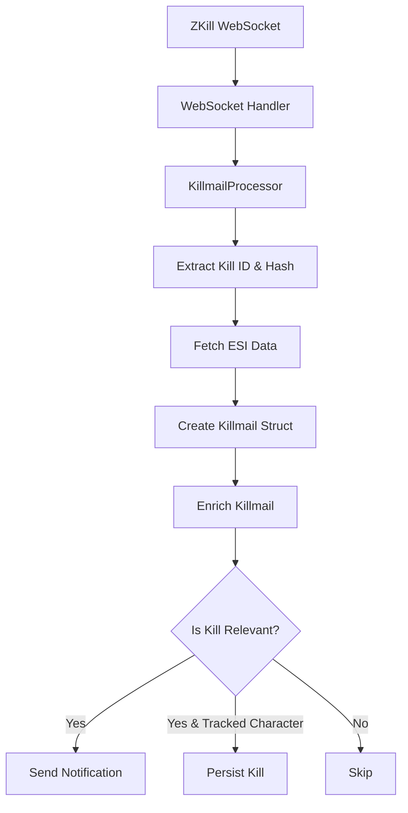
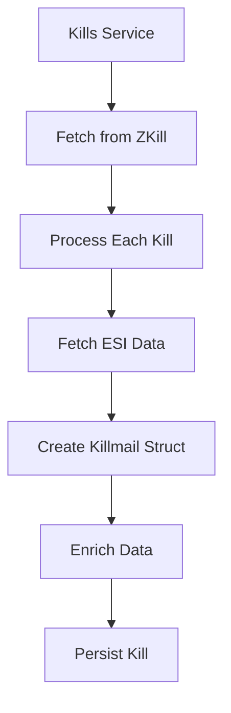

# Killmail Processing System Documentation

## Overview

The killmail processing system handles two main paths for processing EVE Online killmails:

1. Real-time kills via WebSocket from zKillboard
2. Historical kills fetched directly for tracked characters

## Current Implementation

### 1. WebSocket Path (Real-time kills)



Note: The enrichment step is separate from ESI data fetching because it involves additional API calls beyond the initial killmail data. While ESI fetching gets the base killmail data, enrichment adds supplementary information like character names, corporation details, and ship information that requires separate API calls.

### 2. Kills Service Path (Historical kills)



## Key Components

### 1. Data Structure (`WandererNotifier.Data.Killmail`)

- Core struct containing:
  - `killmail_id`: Unique identifier for the kill
  - `zkb` data: Data from zKillboard including kill value, involved parties, etc.
  - `esi_data`: Data from EVE's ESI API containing:
    - Solar system information (ID, name, security status)
    - Victim details (character, corporation, alliance, ship)
    - Attackers list (each with character, corporation, alliance, ship details)
    - Timestamp and other metadata
- Implements Access behaviour for map-like access

### 2. Enrichment Process (`WandererNotifier.Processing.Killmail.Enrichment`)

- Adds system names
- Enriches victim data:
  - Character names
  - Corporation names
  - Alliance names
- Enriches attacker data
- Adds ship type names

Note: Enrichment is separate from initial ESI data fetching because it:

1. Requires multiple additional API calls
2. May need to handle rate limiting
3. Can be cached separately from the base killmail data
4. May fail independently of the base killmail fetch

### 3. Persistence (`WandererNotifier.Resources.KillmailPersistence`)

- Stores kills in PostgreSQL
- Uses caching to prevent duplicate processing
- Tracks kills by character ID and role (attacker/victim)

Multiple Character Handling:

- When multiple tracked characters are involved in a kill:
  - A separate record is created for each character's involvement
  - Each record stores the character's specific role (attacker/victim)
  - The base killmail data is shared across records
  - This allows for accurate tracking of each character's participation while avoiding data duplication

## Identified Issues

### 1. Data Consistency

- Multiple paths for processing kills might lead to inconsistent enrichment
- Different struct types being used (`Data.Killmail` vs `Resources.Killmail`)

### 2. ESI Data Fetching

- Multiple places fetching ESI data independently
- No clear error handling strategy for ESI failures

### 3. Character Tracking

- Complex logic for determining if a character is tracked
- Potential race conditions with cache updates

### 4. Persistence Issues

- Character ID might not be properly passed through the pipeline
- Unclear when kills should be persisted vs skipped

## Proposed Fix Plan

### 1. Standardize Kill Processing

Create a central processing pipeline:

```elixir
defmodule KillmailProcessor do
  def process_kill(kill_id, hash, character_id \\ nil) do
    with {:ok, zkb_data} <- fetch_zkb_data(kill_id),
         {:ok, esi_data} <- fetch_esi_data(kill_id, hash),
         killmail <- create_killmail_struct(kill_id, zkb_data, esi_data),
         enriched <- enrich_killmail(killmail),
         {:ok, _} <- handle_persistence(enriched, character_id),
         {:ok, _} <- handle_notifications(enriched) do
      {:ok, enriched}
    else
      error -> {:error, error}
    end
  end
end
```

### 2. Improve Data Validation

- Add strict validation at each step
- Implement proper error handling and logging
- Add retry mechanisms for ESI failures

### 3. Refactor Character Tracking

- Simplify tracking logic
- Improve caching strategy
- Add proper logging for debugging

### 4. Enhance Persistence Layer

- Ensure character ID is always passed correctly
- Add proper transaction handling
- Improve duplicate detection

## Implementation Priority

1. Standardize the processing pipeline to ensure consistent handling
2. Fix character ID persistence issues
3. Improve error handling and validation
4. Enhance logging and monitoring
5. Optimize caching and performance

## Next Steps

1. Implement the centralized `KillmailProcessor` module
2. Add comprehensive tests for the new processing pipeline
3. Migrate existing code to use the new processor
4. Monitor and validate the changes in production

# Killmail Processing Refactor

## Recent Progress

### Core Processing Pipeline

- ✅ Created new `Core` module as central processing point
- ✅ Updated `Processor` to use Core module for WebSocket kills
- ✅ Updated `KillsService` to use Core module for character kills
- ✅ Fixed character ID tracking and persistence issues

### Logging Improvements

- ✅ Standardized logging format with emojis
- ✅ Added clear WebSocket kill received indicator (📥)
- ✅ Added tracking determination indicators (🎯 for system, 👤 for character)
- ✅ Added notification sent indicator (📬)
- ✅ Moved debug information to appropriate log levels
- ✅ Removed duplicate tracking logs
- ✅ Fixed compilation warnings and unused aliases

### Current State

The killmail processing pipeline now:

1. Receives kills via WebSocket or character history
2. Logs receipt with 📥 emoji
3. Processes through Core module
4. Checks system (🎯) and character (👤) tracking
5. Sends notification (📬) if relevant
6. Persists kill data with proper character association

## Next Steps

### Testing & Validation

1. Test WebSocket kill processing

   - Verify WebSocket messages are properly logged
   - Confirm tracking determination works
   - Check notification delivery

2. Test Character Kill Loading
   - Verify historical kills load correctly
   - Confirm proper persistence with character IDs
   - Check for any performance issues with bulk processing

### Monitoring & Performance

1. Review log output in production

   - Verify log levels are appropriate
   - Check for any noisy or redundant messages
   - Monitor for any unexpected patterns

2. Performance Analysis
   - Monitor memory usage during bulk character loads
   - Check processing times for WebSocket kills
   - Verify cache effectiveness

### Future Improvements

1. Consider adding structured metrics

   - Processing times
   - Success/failure rates
   - Cache hit rates

2. Potential optimizations
   - Batch processing for character kills
   - Improved error recovery
   - Enhanced deduplication

Would you like me to focus on any particular area from the next steps?
