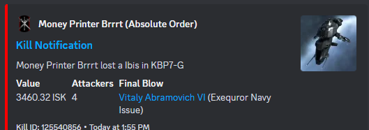
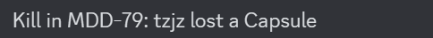
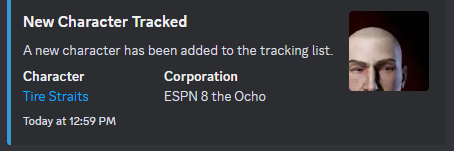
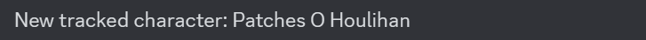
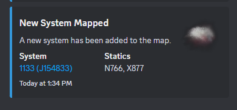
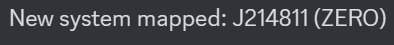
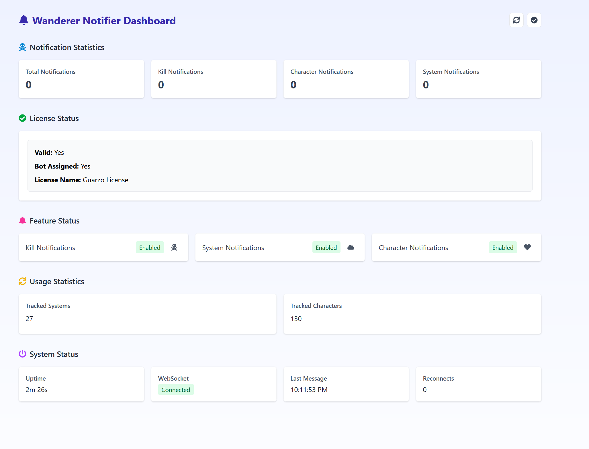

# Notification Types

Wanderer Notifier supports three main notification types, each tailored based on your map subscription status. The first notification sent on application startup is always in rich format, regardless of subscription status.

## Kill Notifications

When a kill occurs in a tracked system or involves a tracked character:

### With Premium Map Subscription

Receives a rich embed that includes:
- **Visual Elements:**
  - Ship thumbnail image from ESI
  - Character portraits for victim 
  - Corporation logos if available
  
- **Victim Information:**
  - Character name with clickable link to zKillboard profile
  - Corporation name and alliance (if applicable)
  - Ship type lost with icon
  
- **Attack Information:**
  - Number of attackers involved
  - Final blow details with clickable link to zKillboard
  - Final blow ship type
  
- **Kill Details:**
  - System name where kill occurred
  - ISK value of the kill formatted appropriately
  - Timestamp of the kill
  - Kill ID with link to zKillboard



### With Free Map

Displays a basic text notification containing:
- Victim name
- Ship type lost
- System name
- Simplified format without images or embeds



### Data Sources
- Initial kill data from zKillboard WebSocket
- Enrichment from ESI for character, corporation, and ship details
- Additional details from zkillboard API when needed

## Character Tracking Notifications

When a new character is added to your tracked list:

### With Premium Map Subscription

You get a rich embed featuring:
- **Visual Elements:**
  - Character portrait from EVE Image Server
  
- **Character Information:**
  - Character name with link to zKillboard profile
  - Character EVE ID for reference
  - Corporation name and ticker
  - Alliance name (if applicable)
  
- **Metadata:**
  - Formatted timestamp of when character was added
  - Clear visual formatting with appropriate color scheme



### With Free Map

Receives a simple text notification that includes:
- Character name
- Corporation name and ticker (if available)
- No images or rich formatting



### Data Sources
- Initial character data from Map API
- Enrichment from ESI for character and corporation details
- Corporation name fallback to ticker if full name unavailable

## System Notifications

When a new system is discovered or added to your map:

### With Premium Map Subscription

Shows a rich embed with:
- **Visual Elements:**
  - System type icon (appropriate for wormhole class, highsec, lowsec, or nullsec)
  - Color coding based on system type and security status
  
- **System Information:**
  - System name (including aliases/temporary names)
  - System ID with link to zKillboard
  - Security status and system type description
  
- **Space-Type Specific Details:**
  - **For Wormholes:**
    - Wormhole class (C1-C6, Thera, etc.)
    - Static wormhole connections listed with destination types
    - Effect information (Red Giant, Black Hole, etc.)
    - Shattered status if applicable
  
  - **For Known Space:**
    - Region name with link to Dotlan
    - Security classification (High-sec, Low-sec, Null-sec)
    - Sovereignty information if available
  
- **Activity Information:**
  - Recent kills in the system from zKillboard
  - For each kill: victim, ship type, value, and time
  - Links to individual killmails



### With Free Map

Provides a basic text notification including:
- Original system name (for wormholes)
- System name (for k-space)
- Minimal type information (wormhole/k-space)



### Data Sources
- Initial system data from Map API
- Static system information from Map API or internal database
- Kill data enrichment from zKillboard API
- Region information from ESI when needed

## Special First Message Behavior

The very first notification of each type sent after application startup is always sent in rich format with full details, regardless of license/subscription status. This helps demonstrate the premium features available with a valid license.

## Web Dashboard

Wanderer Notifier includes a web dashboard that provides real-time insights into your notification system:

- **Access:** Visit `http://localhost:4000` to view the dashboard.
- **System Status:** Monitor system details, subscription information, and notification statistics.
- **Resource Monitoring:** Keep an eye on resource usage and feature availability.
- **Notification Testing:** Test notifications directly from the dashboard.

Premium map subscribers also gain access to detailed statistics and advanced visualization tools.



## Configuration Options

Customize your notification experience with several configuration options available through environment variables.

### Notification Control Variables

- **ENABLE_KILL_NOTIFICATIONS:** Enable/disable kill notifications (default: true).
- **ENABLE_CHARACTER_TRACKING:** Enable/disable character tracking (default: true).
- **ENABLE_CHARACTER_NOTIFICATIONS:** Enable/disable notifications when new characters are added (default: true).
- **ENABLE_SYSTEM_NOTIFICATIONS:** Enable/disable system notifications (default: true).


To disable a notification type, set the corresponding variable to `false` or `0` in your `.env` file:

```dotenv
# Example: Disable kill notifications while keeping other notifications enabled
ENABLE_KILL_NOTIFICATIONS=false
```

## Troubleshooting

If you encounter issues with Wanderer Notifier, here are solutions to common problems:

### No Notifications Appearing

1. **Check Bot Permissions:** Ensure your bot has the "Send Messages" and "Embed Links" permissions in the Discord channel.
2. **Verify Channel ID:** Double-check your DISCORD_CHANNEL_ID in the .env file.
3. **Check Container Logs:** Run `docker logs wanderer_notifier` to see if there are any error messages.
4. **Test API Connection:** Visit `http://localhost:4000/health` to verify the service is running.

### Connection Issues

1. **Network Configuration:** Ensure port 4000 is not blocked by your firewall.
2. **Docker Status:** Run `docker ps` to verify the container is running.
3. **Restart Service:** Try `docker-compose restart` to refresh the connection.

### Subscription Not Recognized

1. **Check Map Token:** Ensure your MAP_TOKEN is correct and associated with your map.
2. **Verify LICENSE_KEY:** Make sure you've entered the correct map subscription key in your .env file.
3. **Verify Status:** Check the dashboard at `http://localhost:4000` to see subscription status.
4. **Restart After Subscribing:** If you've recently subscribed, restart the notifier with `docker-compose restart`.

For additional support, join our [Discord community](https://discord.gg/wanderer)

[Back to home](./index.html) | [See subscription options](https://wanderer.ltd/news/map-subscriptions) | [View on GitHub](https://github.com/guarzo/wanderer-notifier) 